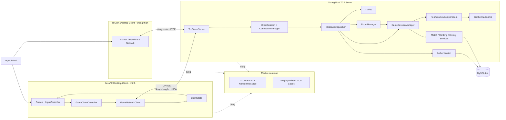
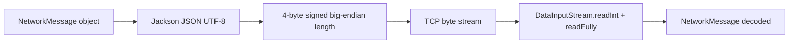
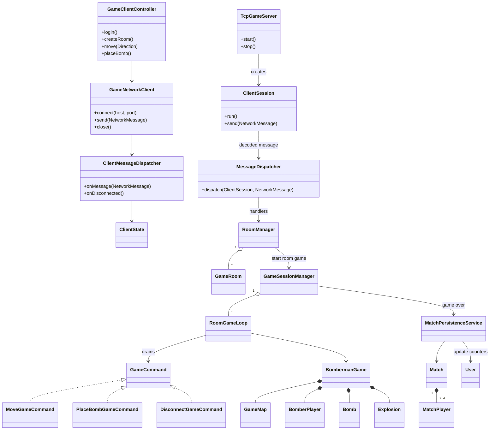
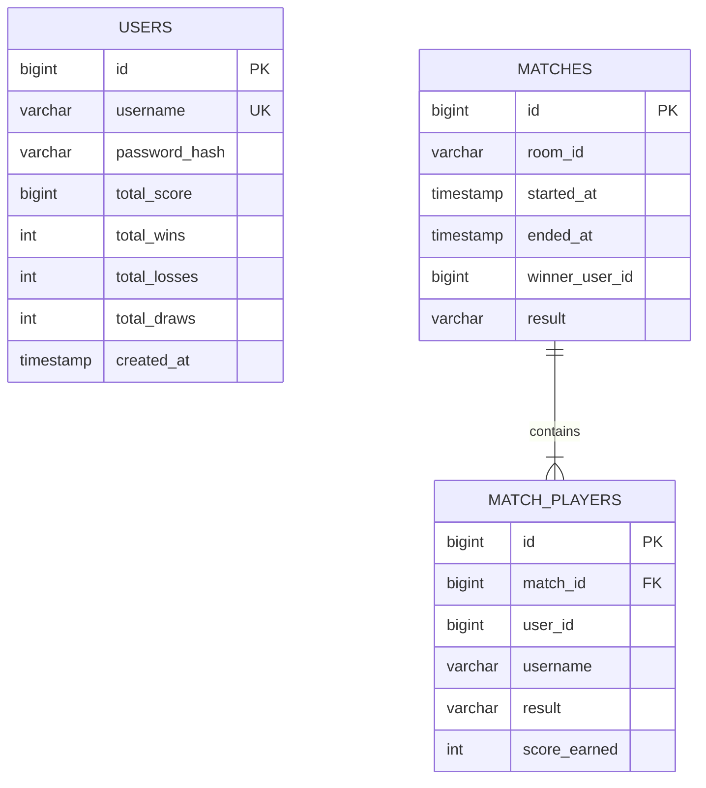
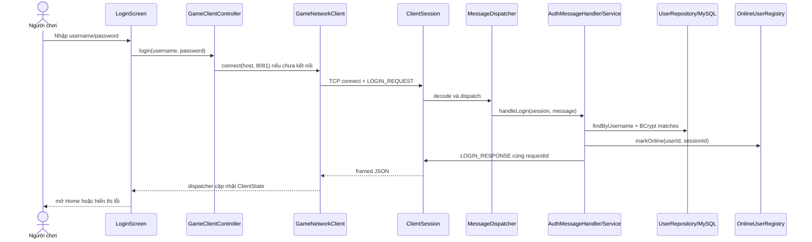
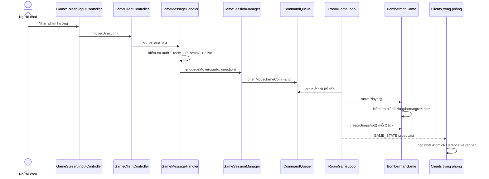
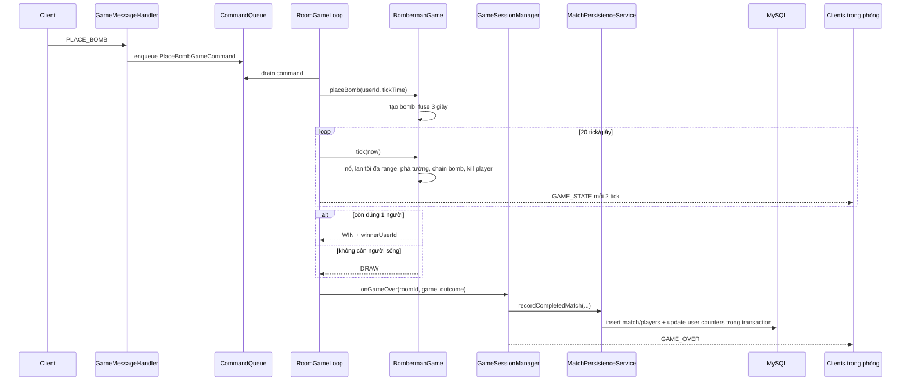
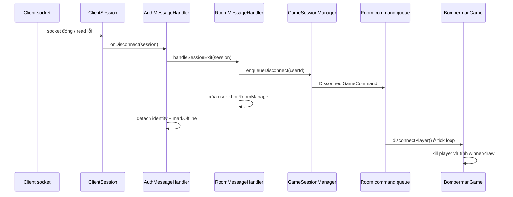
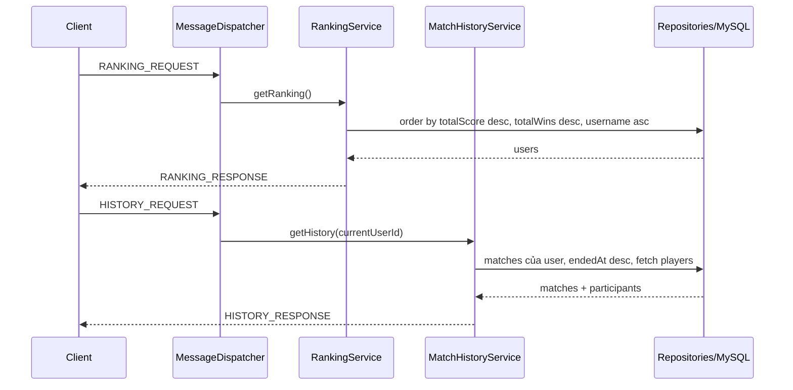

# KẾ HOẠCH PHẦN NHÓM - BÁO CÁO BTL LẬP TRÌNH MẠNG

## Bomberman Online Mini

> Phạm vi: chỉ lập kế hoạch và draft cho phần Nhóm, gồm **mô tả kiến trúc chung** và **mô tả thiết kế chung** của hệ thống. Không đưa nội dung phân công hay mô tả phần cá nhân vào tài liệu này. Chưa tạo DOCX ở bước này.

## 0. Trạng thái, căn cứ và nguyên tắc sử dụng tài liệu

### 0.1 Căn cứ đã đọc

- Yêu cầu phần nhóm: `docs/bao-cao/prompt_bao_cao_nhom.md`.
- Mẫu Word: `docs/bao-cao/doc temp.docx`.
- Toàn bộ mã nguồn sản phẩm trong bốn module Gradle: `common`, `server`, `client`, `client-fx`.
- Cấu hình, build và triển khai: `README.md`, các file `build.gradle`, `settings.gradle`, `docker-compose.yml`, `application.properties`, `client.properties`.
- Mã kiểm thử của các module.

### 0.2 Kết quả kiểm tra file Word mẫu

File mẫu đã được kiểm tra ở mức cấu trúc OOXML. Khi chuyển nội dung sang Word ở giai đoạn sau, cần giữ hệ style và cơ chế tự động của mẫu:

| Vai trò trong báo cáo | Style của mẫu                              |
| ------------------------ | -------------------------------------------- |
| Tiêu đề cấp chương | `CTDT-H1`                                  |
| Tiêu đề mục cấp 2   | `CTDT-H2`                                  |
| Tiêu đề mục cấp 3   | `CTDT-H3`                                  |
| Tiêu đề mục cấp 4   | `CTDT-H4`                                  |
| Nội dung thường       | `CTDT-Text`                                |
| Danh sách               | `CTDT-Bullet1`, `CTDT-Bullet2`           |
| Chú thích hình        | `CTDT-Hinh`                                |
| Chú thích bảng        | `CTDT-Bang`                                |
| Mục lục/danh mục      | TOC và Table of Figures có sẵn trong mẫu |

Mẫu hiện còn nội dung minh họa về Moodle; khi tạo báo cáo chính thức phải thay toàn bộ nội dung minh họa, cập nhật field mục lục/danh mục hình/danh mục bảng, nhưng không phá hệ style. OOXML của mẫu có hai section A4 dọc với kích thước chênh 1-2 twip; khi tạo bản cuối cần chuẩn hóa page geometry để tránh sai lệch page break. Máy audit hiện thiếu LibreOffice nên chưa thể render mẫu sang PNG để kiểm tra trực quan; điều này không cản trở bước lập kế hoạch Markdown hiện tại.

### 0.3 Kết luận kiến trúc ở mức cao

Hệ thống thực tế là kiến trúc kết hợp:

1. **Client-Server tập trung**: một TCP Server phục vụ nhiều Desktop Client qua kết nối TCP duy trì liên tục.
2. **Authoritative Server**: Client chỉ gửi ý định điều khiển; Server kiểm tra và cập nhật trạng thái game.
3. **Layered/Modular Monolith ở Server**: transport/dispatch, application service, domain game/room, persistence được tách theo package nhưng chạy trong cùng một tiến trình Spring Boot.
4. **Event/state-driven presentation ở Client**: UI gọi facade điều khiển, nhận message qua dispatcher và render từ `ClientState`; không đủ bằng chứng để gọi toàn hệ thống là MVC thuần.
5. **Multi-room concurrency**: mỗi phòng đang chơi có một game loop đơn luồng độc lập; nhiều phòng có thể chạy song song.

Không nên mô tả hệ thống là microservices, REST, WebSocket hoặc 3-tier web truyền thống, vì source không chứng minh các mô hình đó.

---

# 1. Kế hoạch thực hiện phần Nhóm

## 1.1 Các gói công việc

| Mã   | Công việc                 | Đầu ra                                                             | Điều kiện hoàn thành                                                               |
| ----- | --------------------------- | -------------------------------------------------------------------- | --------------------------------------------------------------------------------------- |
| WP-01 | Audit source và cấu hình | Bảng facts, module, entry point, bằng chứng test                  | Mọi kết luận chính có source mapping                                               |
| WP-02 | Chốt kiến trúc chung     | Mô hình kiến trúc, bảng thành phần, sơ đồ tổng thể       | Phản ánh đúng JavaFX client chính, TCP Server, MySQL và game loop                 |
| WP-03 | Chốt kiến trúc mạng     | Framing, lifecycle kết nối, session, thread, broadcast, disconnect | Không dùng thuật ngữ REST/WebSocket; nêu đúng port và codec                     |
| WP-04 | Thiết kế module và lớp  | Bảng module, class diagram, quan hệ chính                         | Chọn lớp có vai trò kiến trúc, không liệt kê mọi UI component                 |
| WP-05 | Thiết kế dữ liệu        | Bảng entity, ERD, phân biệt persisted/in-memory                   | Nêu rõ quan hệ JPA thực tế và các ID không có FK                               |
| WP-06 | Thiết kế protocol         | Message matrix hai chiều                                            | Chỉ giữ message có trong`MessageType`; đánh dấu message chưa được sử dụng |
| WP-07 | Thiết kế luồng           | Sequence diagram cho các flow trọng yếu                           | Mỗi flow lần được từ UI đến Server và ngược lại                             |
| WP-08 | Draft Chương 1 và 2      | Nội dung học thuật có thể chuyển vào Word                     | Nhấn mạnh Lập trình mạng, nguyên nhân-xử lý-kết quả                          |
| WP-09 | Rà soát và đóng gói   | Checklist, caption, cross-reference, TOC                             | Phù hợp style Word mẫu; không lẫn phần cá nhân                                  |

## 1.2 Thứ tự ưu tiên hình vẽ

| Ưu tiên | Hình dự kiến                                             | Giá trị giải thích                                               |
| --------: | ----------------------------------------------------------- | -------------------------------------------------------------------- |
|         1 | Hình 2.1 - Kiến trúc tổng thể hệ thống               | Xác định ranh giới Client, Server, CSDL và thư viện`common` |
|         2 | Hình 2.2 - Kiến trúc giao tiếp TCP và mô hình thread | Giải thích kết nối, framing, session và game loop               |
|         3 | Hình 2.3 - Luồng dữ liệu tổng quát                    | Chứng minh Client gửi input, Server phát snapshot                 |
|         4 | Hình 2.4 - Class Diagram lõi                              | Thể hiện quan hệ giữa network, room, game và persistence        |
|         5 | Hình 2.5 - ERD                                             | Làm rõ ba bảng được lưu trong MySQL                           |
|         6 | Hình 2.6 - Sequence đăng nhập                           | Minh họa request/response và session identity                      |
|         7 | Hình 2.7 - Sequence phòng chơi và bắt đầu trận      | Minh họa broadcast`ROOM_STATE` và tạo game loop                 |
|         8 | Hình 2.8 - Sequence thao tác trong trận                  | Minh họa queue, tick, snapshot, broadcast                           |
|         9 | Hình 2.9 - Sequence kết thúc/mất kết nối              | Minh họa xử lý authoritative và persistence                      |

---

# 2. Audit source liên quan phần Nhóm

## 2.1 Bảng khảo sát bắt buộc

| Nội dung                         | Kết quả xác nhận từ source                                                                                                                                                |
| --------------------------------- | ------------------------------------------------------------------------------------------------------------------------------------------------------------------------------ |
| Entry point Client chính         | `client-fx/.../Launcher.main()` gọi `Application.launch(BombermanApp.class)`; `BombermanApp.start()` khởi tạo state, networking, assets và các screen JavaFX        |
| Entry point Client tương thích | `client/.../DesktopLauncher.main()` khởi tạo `Lwjgl3Application(new BombermanClient())`                                                                                  |
| Entry point Server                | `server/.../BombermanServerApplication.main()` khởi động Spring Boot; `TcpGameServer` là `SmartLifecycle` tự mở TCP endpoint                                       |
| Giao thức mạng                  | TCP socket duy trì liên tục, không phải HTTP/REST/WebSocket                                                                                                               |
| Port                              | Server: property`bomberman.tcp.port`, mặc định `8081`; Client: host `127.0.0.1`, port `8081`, có cơ chế override                                                 |
| Đóng gói dữ liệu             | 4-byte signed big-endian payload length + JSON UTF-8 của`NetworkMessage`                                                                                                    |
| Kích thước frame               | Tối đa mặc định 1 MiB; length phải từ 1 đến 1 MiB                                                                                                                     |
| Envelope                          | `type`, `requestId`, `payload`; `requestId` dùng tương quan request-response và có thể `null` cho broadcast                                                    |
| Thread/concurrency Server         | 1 platform acceptor thread; 1 virtual thread cho mỗi`ClientSession`; 1 single-thread scheduled executor cho mỗi phòng đang chơi                                         |
| Thread/concurrency Client         | 1 virtual thread đọc socket; 1 single-thread executor dùng virtual-thread factory để giữ thứ tự ghi; JavaFX Application Thread cho UI;`AtomicReference` cho snapshot |
| Cơ sở dữ liệu                 | MySQL 8.4 khi chạy Docker; Spring Data JPA/Hibernate; test dùng H2                                                                                                           |
| Session                           | Mỗi socket có`ClientSession` với UUID; `AuthenticatedUser` được gắn bằng `AtomicReference`; online presence ánh xạ thêm theo user/session                     |
| Broadcast                         | Lobby broadcast tới user có trạng thái`FREE`; room broadcast tới session của thành viên; game broadcast tới danh sách session của đúng phòng                   |
| Game Engine                       | `BombermanGame`, `GameMap`, `BomberPlayer`, `Bomb`, `Explosion`; lệnh qua `GameCommand`; loop ở `RoomGameLoop`                                                 |
| Nhịp xử lý                     | 20 tick/giây; snapshot phát mỗi 2 tick, tương đương 10 snapshot/giây                                                                                                  |
| Số người/phòng                | Từ 2 đến 4 người để bắt đầu; tối đa 4 người                                                                                                                      |
| Hàng đợi lệnh                 | `ArrayBlockingQueue` tối đa 512 lệnh cho mỗi room loop                                                                                                                   |

## 2.2 Audit theo khu vực source

| Khu vực         | File/lớp trọng yếu                                                                                  | Kết quả audit                                                                                    |
| ---------------- | ------------------------------------------------------------------------------------------------------ | -------------------------------------------------------------------------------------------------- |
| Shared protocol  | `NetworkMessage`, `MessageEncoder`, `MessageDecoder`, DTO, enum                                  | Không chứa business logic; là hợp đồng dữ liệu dùng chung giữa Server và hai Client     |
| Server bootstrap | `BombermanServerApplication`, `TcpGameServer`                                                      | Spring quản lý vòng đời, tự bind TCP khi context khởi động                                |
| Network/session  | `ClientSession`, `SessionWriter`, `ConnectionManager`, `MessageDispatcher`                     | Decode vòng lặp, dispatch theo type, khóa ghi theo socket, registry thread-safe                 |
| Authentication   | `AuthenticationService`, `AuthMessageHandler`, `User`, `OnlineUserRegistry`                    | BCrypt, chống một tài khoản online ở hai session, tách entity khỏi DTO                      |
| Lobby/room       | `LobbyService`, `RoomManager`, `RoomMessageHandler`, `GameRoom`                                | Room giữ trong RAM; một user chỉ thuộc một room; host transfer khi host rời                  |
| Gameplay         | `GameMessageHandler`, `GameSessionManager`, `RoomGameLoop`, `BombermanGame`                    | Network thread chỉ validate/enqueue; loop phòng thực hiện mutation                             |
| Persistence      | `MatchPersistenceService`, `Match`, `MatchPlayer`, repository                                    | Lưu kết quả trận và cập nhật counter xếp hạng trong một transaction                      |
| Ranking/history  | `RankingService`, `MatchHistoryService`, handler                                                   | Query JPA và trả DTO qua TCP                                                                     |
| JavaFX Client    | `BombermanApp`, network package, `ClientState`, các screen, `InputController`, `GameRenderer` | Là giao diện chính; UI không tự xác lập trạng thái game                                   |
| libGDX Client    | `DesktopLauncher`, `BombermanClient`, network/state/screen                                         | Dùng chung protocol, giữ để tương thích; giao diện đơn giản hơn                        |
| Build/deploy     | Gradle files, Docker Compose, properties                                                               | Java 21; Server Spring Boot 3.5.4; JavaFX 21.0.12; MySQL 8.4                                       |
| Test             | unit + integration trong bốn module                                                                   | `gradlew.bat test` thành công; 148 test, 0 failure, 0 error, 0 skipped tại thời điểm audit |

## 2.3 Những khác biệt/điểm cần phản ánh đúng

1. Đăng ký đề tài nói một Server - nhiều Client; source xác nhận điều này và còn bổ sung cơ chế authoritative + multi-room.
2. Source có **hai implementation Desktop Client**. `client-fx` là giao diện chính theo README và packaging; `client` là libGDX client tương thích. Báo cáo nên tập trung `client-fx`, đồng thời ghi nhận client libGDX ở mức kiến trúc triển khai.
3. `PLAYER_DIED` tồn tại trong enum protocol nhưng Server không phát message này; trạng thái sống/chết hiện được truyền trong full `GAME_STATE`, sau đó `GAME_OVER` chốt kết quả.
4. Comment trong `Bomb`/`Explosion` nói hành vi nổ “chưa được triển khai”, nhưng `BombermanGame.tick()` đã triển khai nổ, lan truyền, phá tường, chain reaction và loại người chơi. Báo cáo phải theo implementation, không theo comment đã lỗi thời.
5. README mô tả biến môi trường `BOMBERMAN_DB_PASSWORD`, nhưng `server/src/main/resources/application.properties` hiện đặt mật khẩu datasource trực tiếp thay vì đọc biến đó. Đây là sai lệch cấu hình cần sửa hoặc ghi `[CẦN XÁC NHẬN]` trước khi nộp.

---

# 3. Kiến trúc chung của hệ thống

## 3.1 Mô hình kiến trúc

### Kết luận đề xuất để viết báo cáo

Hệ thống sử dụng kiến trúc **Client-Server kết hợp phân lớp theo module**. Desktop Client chịu trách nhiệm nhận thao tác và trình bày dữ liệu; Server chịu trách nhiệm xác thực, quản lý lobby/phòng, thực thi game engine và lưu dữ liệu. Tại Server, các package network, handler/service, domain và repository tạo thành các lớp trách nhiệm tương đối rõ. Tuy nhiên đây vẫn là một ứng dụng Spring Boot đơn khối, không phải tập hợp dịch vụ độc lập.

Trong gameplay, kiến trúc mang tính **server-authoritative**. Client không gửi tọa độ mới mà chỉ gửi `Direction` hoặc ý định đặt bom. Server kiểm tra session, membership, trạng thái phòng, trạng thái sống và điều kiện va chạm; sau đó game loop của phòng cập nhật mô hình và phát snapshot bất biến. Thiết kế này giảm sai lệch trạng thái giữa các máy và là cơ sở để nhiều Client quan sát cùng một trận đấu nhất quán.

## 3.2 Bảng thành phần chính

| Thành phần          | Trách nhiệm                                         | Input                                   | Output                                        | Giao tiếp với                  | Source mapping |
| --------------------- | ----------------------------------------------------- | --------------------------------------- | --------------------------------------------- | -------------------------------- | -------------- |
| JavaFX Desktop Client | UI chính, thu input, hiển thị lobby/game/kết quả | Thao tác người dùng, message Server | Command TCP, UI frame                         | TCP Client,`ClientState`       | SM-01, SM-02   |
| libGDX Desktop Client | Client tương thích giao thức                      | Thao tác người dùng, message Server | Command TCP, frame libGDX                     | Cùng TCP Server                 | SM-03          |
| TCP Client            | Mở socket, đọc/ghi frame, báo disconnect          | `NetworkMessage`, byte stream         | Byte stream, callback message                 | Server TCP, dispatcher client    | SM-02          |
| TCP Server            | Listen/accept, tạo session                           | Kết nối TCP                           | `ClientSession` trên virtual thread        | Client, dispatcher               | SM-04          |
| Connection/Session    | Quản lý vòng đời socket và identity             | Frame đã decode                       | Message cho handler, frame phản hồi         | Dispatcher, registries           | SM-05          |
| Authentication        | Đăng ký, xác minh BCrypt, login/logout            | Credential DTO                          | Response và session identity                 | User repository, online registry | SM-06          |
| Lobby                 | Snapshot người online và danh sách phòng         | Request hoặc thay đổi presence/room  | `ONLINE_USERS_UPDATE`, `ROOM_LIST_UPDATE` | Room manager, registry           | SM-07          |
| Room                  | Tạo/tham gia/rời/ready/start/rematch                | Room command                            | `ROOM_STATE`, thay đổi status             | Lobby, game session manager      | SM-08          |
| Game Engine           | Kiểm tra di chuyển/bom, tick, nổ, kết quả        | Command queue, clock                    | Snapshot, outcome                             | Room loop, state mapper          | SM-09          |
| Game Session Manager  | Tạo loop/phòng, route command, broadcast            | Room snapshot, game command             | `GAME_STATE`, `GAME_OVER`                 | Room, persistence, connection    | SM-10          |
| Persistence/Database  | Lưu account, match, player result, ranking counters  | Entity mutation/JPA query               | Entity/DTO data                               | MySQL                            | SM-11          |
| Shared Protocol       | Hợp đồng message/DTO/codec                         | Object/message                          | JSON frame và DTO                            | Tất cả Client/Server           | SM-12          |

## 3.3 Sơ đồ kiến trúc tổng thể



## 3.4 Ranh giới trạng thái

| Trạng thái                                              | Nơi sở hữu                           | Cơ chế đồng bộ               | Có lưu CSDL?                                     |
| --------------------------------------------------------- | --------------------------------------- | --------------------------------- | -------------------------------------------------- |
| Tài khoản, password hash, tổng điểm/thắng/thua/hòa | Server/JPA                              | Transaction                       | Có                                                |
| Lịch sử trận và người tham gia                      | Server/JPA                              | Transaction khi game over         | Có                                                |
| Kết nối TCP và authenticated identity                  | `ClientSession`/`ConnectionManager` | Concurrent map + atomic reference | Không                                             |
| Người chơi online/trạng thái FREE-IN_ROOM-PLAYING    | `OnlineUserRegistry`                  | Concurrent map                    | Không                                             |
| Danh sách phòng, host, ready, room status               | `RoomManager`                         | Mutation lock                     | Không                                             |
| Trạng thái trận, map, vị trí, bom, nổ               | `BombermanGame` trong room loop       | Single-thread loop + snapshot     | Không; chỉ lưu kết quả cuối                  |
| Presentation state                                        | Mỗi Client                             | UI thread + atomic snapshot       | Chỉ preference local; không phải game authority |

---

# 4. Kiến trúc mạng

## 4.1 Kết nối và framing



- Server bind `ServerSocket` vào `bomberman.tcp.port`; mặc định 8081.
- Client tạo `Socket`, connect với timeout 3 giây, bật `TCP_NODELAY` và giữ kết nối cho nhiều request.
- `MessageEncoder` ghi length trước payload; `MessageDecoder.readFully()` không phụ thuộc ranh giới TCP packet.
- JSON malformed hoặc length không hợp lệ phát sinh `ProtocolException`; Server đóng session vi phạm.
- Mỗi message có `requestId` UUID từ Client. Response trực tiếp giữ requestId; broadcast thường có requestId `null`.

## 4.2 Mô hình thread và vùng đồng bộ

| Vùng                    | Thread/executor                                 | Bảo vệ dữ liệu                                                        |
| ------------------------ | ----------------------------------------------- | ------------------------------------------------------------------------- |
| Accept kết nối         | 1 platform thread`tcp-game-acceptor`          | `AtomicBoolean running` và lifecycle đồng bộ                        |
| Đọc mỗi socket Server | 1 virtual thread/session                        | Session tự sở hữu input stream                                         |
| Ghi mỗi socket Server   | Có thể được gọi từ nhiều thread         | `SessionWriter` dùng `ReentrantLock` tránh interleave frame         |
| Registry kết nối       | Nhiều thread                                   | `ConcurrentHashMap`; broadcast qua snapshot copy                        |
| Room membership          | Nhiều handler thread                           | `RoomManager.mutationLock` và concurrent maps                          |
| Online presence          | Nhiều handler thread                           | `ConcurrentHashMap.compute...`                                          |
| Command gameplay         | Network thread sản xuất, room loop tiêu thụ | `ArrayBlockingQueue` 512 phần tử                                      |
| Game mutation            | 1 scheduled thread/phòng                       | Loop đơn luồng;`BombermanGame.stateLock` bổ sung an toàn khi đọc |
| Ghi Client               | UI/controller phát lệnh                       | Single-thread executor + socket write lock                                |
| Đọc Client             | 1 virtual thread                                | Dispatcher; UI change chuyển sang JavaFX thread                          |
| Snapshot Client          | Network thread ghi, render thread đọc         | `AtomicReference<GameStateDto>`                                         |

## 4.3 Bảng giao tiếp

| Thành phần gửi    | Thành phần nhận                  | Giao thức       | Dữ liệu                             | Cách xử lý                                                   |
| -------------------- | ----------------------------------- | ---------------- | ------------------------------------- | --------------------------------------------------------------- |
| JavaFX/libGDX Client | `TcpGameServer`/`ClientSession` | TCP              | Length-prefixed JSON command          | Decode, dispatch theo`MessageType`                            |
| Handler Server       | Client yêu cầu                    | Cùng socket TCP | Response cùng requestId              | Client dispatcher cập nhật state và complete pending request |
| Lobby Service        | Các session đang`FREE`          | Cùng socket TCP | Full online/room list                 | Broadcast snapshot, requestId`null`                           |
| Room Handler         | Thành viên cùng phòng           | Cùng socket TCP | Full`RoomStateUpdate`               | Gửi theo sessionId trong room snapshot                         |
| Game Session Manager | Thành viên trận                  | Cùng socket TCP | Full`GameStateDto`, `GameOverDto` | Phát theo danh sách session của đúng room                  |

## 4.4 Vòng đời mất kết nối

1. Read loop nhận `IOException`/`SocketException` hoặc protocol violation.
2. `ClientSession.close()` đóng socket.
3. `MessageDispatcher.onDisconnect()` chuyển sang `AuthMessageHandler.handleDisconnect()`.
4. Nếu user đang chơi, `DisconnectGameCommand` được đưa vào room game loop để việc chết và xác định thắng/hòa vẫn xảy ra trên authoritative thread.
5. User bị xóa khỏi room, online registry được dọn theo đúng sessionId, lobby/room snapshot được cập nhật.
6. Client nhận disconnect callback, xóa state, fail các pending request và quay về màn hình login.

---

# 5. Luồng dữ liệu tổng quát

```mermaid
flowchart LR
    A[User input\nWASD/Arrow/Space]
    B[JavaFX GameScreen]
    C[InputController]
    D[GameClientController]
    E[GameNetworkClient + Encoder]
    F[ClientSession + Decoder]
    G[MessageDispatcher]
    H[GameMessageHandler\nvalidate auth/room/alive]
    I[GameSessionManager]
    J[Bounded GameCommand queue]
    K[RoomGameLoop 20 Hz]
    L[BombermanGame mutation]
    M[Immutable snapshot]
    N[GAME_STATE broadcast 10 Hz]
    O[ClientMessageDispatcher]
    P[Atomic ClientState]
    Q[GameRenderer]

    A --> B --> C --> D --> E --> F --> G --> H --> I --> J --> K --> L --> M --> N --> O --> P --> Q
```



Điểm cần nhấn mạnh trong báo cáo: network thread không trực tiếp gọi `movePlayer()` hay `placeBomb()`. Nó chỉ validate bối cảnh session rồi enqueue command. Mọi command hợp lệ trong một phòng được drain theo thứ tự và thực thi bởi game loop duy nhất của phòng.

---

# 6. Thiết kế module

| Module/package                    | Trách nhiệm                                   | Class/file chính                                                                                 | Quan hệ                                                   |
| --------------------------------- | ----------------------------------------------- | ------------------------------------------------------------------------------------------------- | ---------------------------------------------------------- |
| `common`                        | Hợp đồng protocol, DTO, enum, codec          | `NetworkMessage`, `MessageEncoder`, `MessageDecoder`, DTO records                           | Được cả Server và hai Client phụ thuộc              |
| `server.network`                | TCP endpoint, session, dispatch, ordered writes | `TcpGameServer`, `ClientSession`, `MessageDispatcher`, `SessionWriter`                    | Chuyển message tới handler nghiệp vụ                   |
| `server.auth` + `server.user` | Account, login/logout, presence                 | `AuthenticationService`, `AuthMessageHandler`, `OnlineUserRegistry`, `User`               | Dùng JPA repository và cập nhật lobby                  |
| `server.lobby`                  | Danh sách online/phòng                        | `LobbyService`, `LobbyMessageHandler`                                                         | Đọc online registry và room snapshot                    |
| `server.room`                   | Room aggregate và lifecycle                    | `RoomManager`, `GameRoom`, `RoomMessageHandler`                                             | Khởi tạo`GameSessionManager` khi start                 |
| `server.game`                   | Authoritative game engine, per-room loop        | `BombermanGame`, `RoomGameLoop`, `GameSessionManager`, `GameMap`                          | Nhận command; phát state/outcome                         |
| `server.match`                  | Lưu trận, scoring, history                    | `MatchPersistenceService`, `Match`, `MatchPlayer`, `MatchHistoryService`                  | Dùng repository; được game manager gọi khi kết thúc |
| `server.ranking`                | Xếp hạng                                      | `RankingService`, `RankingMessageHandler`                                                     | Đọc counters trong`User`                               |
| `server.repository`             | Data access                                     | Ba Spring Data repository                                                                         | MySQL/H2                                                   |
| `client-fx.network`             | Socket, protocol facade, dispatch, correlation  | `GameNetworkClient`, `GameClientController`, `ClientMessageDispatcher`, `PendingRequests` | Nối UI với Server                                        |
| `client-fx.state`               | Presentation state                              | `ClientState`, `Feedback`                                                                     | Screen lắng nghe; snapshot atomic                         |
| `client-fx.ui`/`game`         | Screen, input, render, hiệu ứng               | `BombermanApp`, screens, `InputController`, `GameRenderer`                                  | Chỉ render snapshot/emit command                          |
| `client`                        | Client libGDX tương thích                    | `BombermanClient`, network/state/screen                                                         | Dùng chung module`common` và cùng Server              |

---

# 7. Thiết kế lớp

## 7.1 Class diagram lõi



## 7.2 Nhóm lớp nên mô tả trong bài

| Nhóm            | Lớp chọn                                                                     | Lý do                                                              |
| ---------------- | ------------------------------------------------------------------------------ | ------------------------------------------------------------------- |
| Kết nối Client | `GameNetworkClient`, `GameClientController`, `ClientMessageDispatcher`   | Bao phủ send/receive, facade UI, chuyển thread                    |
| Kết nối Server | `TcpGameServer`, `ClientSession`, `SessionWriter`, `MessageDispatcher` | Bao phủ accept, session, framing, dispatch, write serialization    |
| Session/user     | `AuthenticatedUser`, `OnlineUserRegistry`, `User`                        | Phân biệt session runtime, presence runtime và account persisted |
| Lobby/room       | `RoomManager`, `GameRoom`, `RoomMessageHandler`                          | Thể hiện aggregate và rule room                                  |
| Game             | `GameSessionManager`, `RoomGameLoop`, `BombermanGame`                    | Thể hiện command queue, loop và authoritative mutation           |
| Domain game      | `GameMap`, `BomberPlayer`, `Bomb`, `Explosion`                         | Thể hiện dữ liệu và rule gameplay                              |
| Kết quả/CSDL   | `Match`, `MatchPlayer`, `MatchPersistenceService`, `RankingService`    | Thể hiện lưu kết quả và truy vấn                             |

Không đưa toàn bộ component/theme/SVG của JavaFX vào class diagram phần nhóm vì chúng làm loãng nội dung kiến trúc mạng.

---

# 8. Thiết kế dữ liệu

## 8.1 Entity được lưu

| Entity/bảng                        | Thuộc tính chính                                                                                                   | Quan hệ thực tế                                           | Source |
| ----------------------------------- | --------------------------------------------------------------------------------------------------------------------- | ------------------------------------------------------------ | ------ |
| `User` / `users`                | `id`, `username`, `passwordHash`, `totalScore`, `totalWins`, `totalLosses`, `totalDraws`, `createdAt` | Không khai báo collection tới match; username unique      | SM-11  |
| `Match` / `matches`             | `id`, `roomId`, `startedAt`, `endedAt`, `winnerUserId`, `result`                                          | One-to-many tới`MatchPlayer`, cascade all, orphan removal | SM-11  |
| `MatchPlayer` / `match_players` | `id`, `match_id`, `userId`, `username`, `result`, `scoreEarned`                                           | Many-to-one tới`Match`; unique `(match_id, user_id)`    | SM-11  |

Lưu ý chính xác: `MatchPlayer.userId` và `Match.winnerUserId` là giá trị ID dạng số, không được mapping thành foreign key JPA tới `User`. Cách thiết kế này giữ snapshot username/kết quả tại thời điểm trận đấu nhưng không tạo quan hệ object trực tiếp tới account.

## 8.2 ERD



## 8.3 Dữ liệu runtime không lưu CSDL

- Socket/session và authenticated identity.
- Online presence và trạng thái `FREE`, `IN_ROOM`, `PLAYING`.
- Room aggregate, host, ready flag, trạng thái phòng.
- Bản đồ hiện tại, vị trí người chơi, bom, explosion, command queue và tick.
- Full `GAME_STATE` snapshot.

Chỉ kết quả cuối trận và các counters xếp hạng được ghi transactionally. Không có chức năng phục hồi trận đang chơi sau khi Server khởi động lại.

---

# 9. Thiết kế giao thức/message

## 9.1 Envelope chung

```json
{
  "type": "MOVE",
  "requestId": "uuid",
  "payload": {
    "direction": "UP"
  }
}
```

## 9.2 Message từ Client tới Server

| Message                  | Hướng | Payload/field              | Ý nghĩa                                           | Server handler                                     |
| ------------------------ | ------- | -------------------------- | --------------------------------------------------- | -------------------------------------------------- |
| `PING`                 | C -> S  | Không có                 | Kiểm tra kết nối                                 | `MessageDispatcher.replyWithPong()`              |
| `REGISTER_REQUEST`     | C -> S  | `username`, `password` | Tạo tài khoản                                    | `AuthMessageHandler.handleRegister()`            |
| `LOGIN_REQUEST`        | C -> S  | `username`, `password` | Gắn user vào session                              | `AuthMessageHandler.handleLogin()`               |
| `LOGOUT`               | C -> S  | Không có                 | Dọn room/presence, giữ socket mở                 | `AuthMessageHandler.handleLogout()`              |
| `ONLINE_USERS_REQUEST` | C -> S  | Không có                 | Lấy snapshot người online                        | `LobbyMessageHandler.handleOnlineUsersRequest()` |
| `ROOM_LIST_REQUEST`    | C -> S  | Không có                 | Lấy snapshot danh sách phòng                     | `LobbyMessageHandler.handleRoomListRequest()`    |
| `CREATE_ROOM`          | C -> S  | `roomName`               | Tạo room và trở thành host                      | `RoomMessageHandler.handleCreateRoom()`          |
| `JOIN_ROOM`            | C -> S  | `roomId`                 | Tham gia room đang chờ                            | `RoomMessageHandler.handleJoinRoom()`            |
| `LEAVE_ROOM`           | C -> S  | Không có                 | Rời room; nếu đang chơi thì enqueue disconnect | `RoomMessageHandler.handleLeaveRoom()`           |
| `READY`                | C -> S  | `ready`                  | Đổi trạng thái sẵn sàng                       | `RoomMessageHandler.handleReady()`               |
| `START_GAME`           | C -> S  | Không có                 | Host yêu cầu bắt đầu khi đủ điều kiện     | `RoomMessageHandler.handleStartGame()`           |
| `MOVE`                 | C -> S  | `direction`              | Ý định di chuyển một ô                        | `GameMessageHandler.handleMove()`                |
| `PLACE_BOMB`           | C -> S  | Không có                 | Ý định đặt bom tại vị trí hiện tại        | `GameMessageHandler.handlePlaceBomb()`           |
| `PLAY_AGAIN`           | C -> S  | Không có                 | Đưa room`FINISHED` về `WAITING`              | `RoomMessageHandler.handlePlayAgain()`           |
| `RANKING_REQUEST`      | C -> S  | Không có                 | Yêu cầu bảng xếp hạng                          | `RankingMessageHandler.handleRequest()`          |
| `HISTORY_REQUEST`      | C -> S  | Không có                 | Yêu cầu lịch sử của user hiện tại            | `HistoryMessageHandler.handleRequest()`          |

## 9.3 Message từ Server tới Client

| Message                 | Hướng | Payload/field chính                                                                            | Ý nghĩa                                       | Client xử lý                   |
| ----------------------- | ------- | ----------------------------------------------------------------------------------------------- | ----------------------------------------------- | -------------------------------- |
| `PONG`                | S -> C  | Không có                                                                                      | Phản hồi`PING`, cùng requestId             | Dispatcher hiện không đổi UI |
| `REGISTER_RESPONSE`   | S -> C  | `success`, `result`, `userId`, `username`                                               | Kết quả đăng ký                            | Thông báo thành công/lỗi    |
| `LOGIN_RESPONSE`      | S -> C  | `success`, `result`, `userId`, `username`, `status`                                   | Kết quả đăng nhập                          | Lưu identity, mở Home          |
| `ONLINE_USERS_UPDATE` | S -> C  | `users[]`                                                                                     | Full snapshot online                            | Thay danh sách trong state      |
| `ROOM_LIST_UPDATE`    | S -> C  | `rooms[]`                                                                                     | Full snapshot phòng                            | Thay danh sách trong state      |
| `ROOM_STATE`          | S -> C  | `member`, `room`                                                                            | Full snapshot room hoặc xác nhận đã rời   | Điều hướng Lobby/Game/Home   |
| `GAME_STATE`          | S -> C  | `tick`, `gameStatus`, `map`, `players`, `bombs`, `explosions`, `remainingPlayers` | Full authoritative snapshot                     | Ghi atomic reference và render  |
| `GAME_OVER`           | S -> C  | `winnerUserId`, `matchResult`, `players[]`                                                | Kết quả toàn trận và từng người         | Hiển thị Result                |
| `RANKING_RESPONSE`    | S -> C  | `entries[]`                                                                                   | Bảng xếp hạng                                | Cập nhật leaderboard           |
| `HISTORY_RESPONSE`    | S -> C  | `matches[]`                                                                                   | Lịch sử của user                             | Cập nhật history               |
| `ERROR`               | S -> C  | `code`, `message`                                                                           | Auth/room/game/protocol-level application error | Toast hoặc complete future lỗi |

## 9.4 Message khai báo nhưng chưa có luồng phát thực tế

| Message         | Trạng thái source                                                                                                    | Cách diễn đạt trong báo cáo                                                                                             |
| --------------- | ---------------------------------------------------------------------------------------------------------------------- | ----------------------------------------------------------------------------------------------------------------------------- |
| `PLAYER_DIED` | Có trong`MessageType` nhưng không có lệnh tạo/gửi ở Server và Client dispatcher cũng không xử lý riêng | Không mô tả là chức năng protocol đang hoạt động; trạng thái chết hiện nằm trong`GAME_STATE.players[].alive` |

## 9.5 Quy tắc phản hồi đáng chú ý

- `CREATE_ROOM`, `JOIN_ROOM`, `LEAVE_ROOM`, `READY`, `START_GAME`, `PLAY_AGAIN` không có response type riêng; thành công được biểu diễn bằng `ROOM_STATE` cùng requestId của requester.
- `MOVE` và `PLACE_BOMB` không có ACK khi enqueue thành công; hiệu lực được quan sát qua `GAME_STATE` kế tiếp. Chỉ trường hợp validation/queue thất bại mới nhận `ERROR`.
- Lobby/room/game broadcast có thể không mang requestId vì không phải response của một request cụ thể.

---

# 10. Các flow chính và Mermaid sequence diagram

## 10.1 Kết nối và đăng nhập



## 10.2 Tạo/tham gia phòng, Ready và bắt đầu trận

```mermaid
sequenceDiagram
    participant C1 as Host Client
    participant C2 as Guest Client
    participant RH as RoomMessageHandler
    participant RM as RoomManager
    participant OR as OnlineUserRegistry
    participant GS as GameSessionManager
    participant L as RoomGameLoop

    C1->>RH: CREATE_ROOM(roomName)
    RH->>RM: createRoom(user, sessionId, name)
    RH->>OR: status = IN_ROOM
    RH-->>C1: ROOM_STATE

    C2->>RH: JOIN_ROOM(roomId)
    RH->>RM: joinRoom(...)
    RH->>OR: status = IN_ROOM
    RH-->>C1: ROOM_STATE broadcast
    RH-->>C2: ROOM_STATE cùng requestId

    C1->>RH: READY(true)
    C2->>RH: READY(true)
    RH-->>C1: ROOM_STATE
    RH-->>C2: ROOM_STATE

    C1->>RH: START_GAME
    RH->>RM: validate host, >=2, all ready; status=PLAYING
    RH->>OR: players status = PLAYING
    RH->>GS: startGame(RoomSnapshot)
    GS->>L: create + start loop riêng của room
    RH-->>C1: ROOM_STATE PLAYING
    RH-->>C2: ROOM_STATE PLAYING
```

## 10.3 Di chuyển và đồng bộ snapshot



## 10.4 Đặt bom, nổ và kết thúc trận



## 10.5 Mất kết nối trong trận



## 10.6 Ranking và lịch sử



---

# 11. Source mapping catalog

Các bảng và đoạn draft phía trên dùng các mã sau. Khi chuyển vào bản báo cáo cuối, có thể đổi catalog này thành chú thích kỹ thuật hoặc phụ lục nguồn.

### SM-01 - Bootstrap và cấu trúc JavaFX Client

```text
Source:
- File: client-fx/src/main/java/com/bomberman/clientfx/Launcher.java
- Class: Launcher
- Method: main
- Vai trò: Entry point, khởi động JavaFX Application.

Source:
- File: client-fx/src/main/java/com/bomberman/clientfx/BombermanApp.java
- Class: BombermanApp
- Method: start, stop
- Vai trò: Ghép state, networking, dispatcher, screen, assets và vòng đời ứng dụng.
```

### SM-02 - Network và state của JavaFX Client

```text
Source:
- File: client-fx/src/main/java/com/bomberman/clientfx/network/GameNetworkClient.java
- Class: GameNetworkClient
- Method: connect, send, readMessages, close
- Vai trò: Socket TCP duy trì liên tục, virtual read thread, khóa ghi.

Source:
- File: client-fx/src/main/java/com/bomberman/clientfx/network/GameClientController.java
- Class: GameClientController
- Method: request, send, sendInBackground
- Vai trò: Facade lệnh từ UI, requestId, ordered writer, lazy connect.

Source:
- File: client-fx/src/main/java/com/bomberman/clientfx/network/ClientMessageDispatcher.java
- Class: ClientMessageDispatcher
- Method: onMessage, dispatchOnUiThread, handleGameStateFromNetworkThread
- Vai trò: Decode payload, cập nhật state, chuyển UI thread và điều hướng.

Source:
- File: client-fx/src/main/java/com/bomberman/clientfx/state/ClientState.java
- Class: ClientState
- Method: setLatestGameState, beginGame, setGameOver
- Vai trò: Presentation state; snapshot authoritative qua AtomicReference.
```

### SM-03 - Client libGDX tương thích

```text
Source:
- File: client/src/main/java/com/bomberman/client/DesktopLauncher.java
- Class: DesktopLauncher
- Method: main
- Vai trò: Entry point libGDX/LWJGL3.

Source:
- File: client/src/main/java/com/bomberman/client/BombermanClient.java
- Class: BombermanClient
- Method: create, dispose
- Vai trò: Ghép screen, state và network của client tương thích.
```

### SM-04 - TCP Server bootstrap

```text
Source:
- File: server/src/main/java/com/bomberman/server/BombermanServerApplication.java
- Class: BombermanServerApplication
- Method: main
- Vai trò: Khởi động Spring Boot context.

Source:
- File: server/src/main/java/com/bomberman/server/network/TcpGameServer.java
- Class: TcpGameServer
- Method: start, acceptConnections, submitSession, stop
- Vai trò: Bind port, accept socket, cấp virtual thread cho session.
```

### SM-05 - Session, dispatch và write ordering

```text
Source:
- File: server/src/main/java/com/bomberman/server/network/ClientSession.java
- Class: ClientSession
- Method: run, send, attachAuthenticatedUser, close
- Vai trò: Vòng đời một kết nối, decode loop, session identity.

Source:
- File: server/src/main/java/com/bomberman/server/network/SessionWriter.java
- Class: SessionWriter
- Method: send
- Vai trò: Khóa toàn bộ thao tác encode/write để frame không xen kẽ.

Source:
- File: server/src/main/java/com/bomberman/server/network/ConnectionManager.java
- Class: ConnectionManager
- Method: add, snapshot, broadcast, closeAll
- Vai trò: Registry session thread-safe.

Source:
- File: server/src/main/java/com/bomberman/server/network/MessageDispatcher.java
- Class: MessageDispatcher
- Method: dispatch, onDisconnect
- Vai trò: Route message tới handler đúng domain.
```

### SM-06 - Xác thực và presence

```text
Source:
- File: server/src/main/java/com/bomberman/server/auth/AuthenticationService.java
- Class: AuthenticationService
- Method: register, login, logout
- Vai trò: Validation, BCrypt, account lookup, chống login trùng.

Source:
- File: server/src/main/java/com/bomberman/server/auth/AuthMessageHandler.java
- Class: AuthMessageHandler
- Method: handleRegister, handleLogin, cleanupSession
- Vai trò: Chuyển protocol auth thành service call và dọn session.

Source:
- File: server/src/main/java/com/bomberman/server/user/OnlineUserRegistry.java
- Class: OnlineUserRegistry
- Method: markOnline, markOffline, updateStatus, snapshot
- Vai trò: Presence runtime theo userId/sessionId.
```

### SM-07 - Lobby

```text
Source:
- File: server/src/main/java/com/bomberman/server/lobby/LobbyService.java
- Class: LobbyService
- Method: broadcastLobbyUpdates, onlineUsersMessage, roomListMessage
- Vai trò: Tạo và gửi authoritative lobby snapshots.
```

### SM-08 - Room

```text
Source:
- File: server/src/main/java/com/bomberman/server/room/RoomManager.java
- Class: RoomManager
- Method: createRoom, joinRoom, leaveRoom, setReady, startGame, finishGame, prepareRematch
- Vai trò: Rule room và one-room-per-user dưới mutation lock.

Source:
- File: server/src/main/java/com/bomberman/server/room/RoomMessageHandler.java
- Class: RoomMessageHandler
- Method: handleCreateRoom, handleJoinRoom, handleLeaveRoom, handleStartGame, handleSessionExit
- Vai trò: Adapter protocol, presence update, room broadcast, start game.
```

### SM-09 - Game domain và loop

```text
Source:
- File: server/src/main/java/com/bomberman/server/game/RoomGameLoop.java
- Class: RoomGameLoop
- Method: start, enqueue, runTickSafely, drainCommands
- Vai trò: Loop đơn luồng 20 Hz, queue 512, snapshot mỗi 2 tick.

Source:
- File: server/src/main/java/com/bomberman/server/game/BombermanGame.java
- Class: BombermanGame
- Method: movePlayer, placeBomb, tick, disconnectPlayer, createSnapshot
- Vai trò: Authoritative game rules và trạng thái.

Source:
- File: server/src/main/java/com/bomberman/server/game/GameMap.java
- Class: GameMap
- Method: createDefault, destroyBreakableWall, snapshotTiles
- Vai trò: Bản đồ 13x11, wall/spawn rules.
```

### SM-10 - Game routing, snapshot và game over

```text
Source:
- File: server/src/main/java/com/bomberman/server/game/GameMessageHandler.java
- Class: GameMessageHandler
- Method: handleMove, handlePlaceBomb, validateGameplaySession
- Vai trò: Validate session rồi enqueue, không mutate game trực tiếp.

Source:
- File: server/src/main/java/com/bomberman/server/game/GameSessionManager.java
- Class: GameSessionManager
- Method: startGame, enqueueMove, enqueuePlaceBomb, enqueueDisconnect, broadcastGameState, handleGameOver
- Vai trò: Quản lý loop theo room, route command, broadcast, persistence.
```

### SM-11 - Persistence, history và ranking

```text
Source:
- File: server/src/main/java/com/bomberman/server/user/User.java
- Class: User
- Method: recordMatch
- Vai trò: Entity account và denormalized ranking counters.

Source:
- File: server/src/main/java/com/bomberman/server/match/Match.java
- Class: Match
- Method: addPlayer
- Vai trò: Entity trận và quan hệ one-to-many.

Source:
- File: server/src/main/java/com/bomberman/server/match/MatchPlayer.java
- Class: MatchPlayer
- Method: attachTo
- Vai trò: Entity kết quả từng người.

Source:
- File: server/src/main/java/com/bomberman/server/match/MatchPersistenceService.java
- Class: MatchPersistenceService
- Method: recordCompletedMatch
- Vai trò: Transaction lưu match/player và cập nhật User.

Source:
- File: server/src/main/java/com/bomberman/server/ranking/RankingService.java
- Class: RankingService
- Method: getRanking
- Vai trò: Xếp hạng theo score, win, username.

Source:
- File: server/src/main/java/com/bomberman/server/match/MatchHistoryService.java
- Class: MatchHistoryService
- Method: getHistory
- Vai trò: Chuyển entity lịch sử thành DTO theo người xem.
```

### SM-12 - Protocol codec và DTO

```text
Source:
- File: common/src/main/java/com/bomberman/common/message/NetworkMessage.java
- Class: NetworkMessage
- Method: record constructor, withoutPayload
- Vai trò: Envelope type-requestId-payload.

Source:
- File: common/src/main/java/com/bomberman/common/message/codec/MessageEncoder.java
- Class: MessageEncoder
- Method: encode
- Vai trò: JSON UTF-8 + 4-byte length, giới hạn 1 MiB.

Source:
- File: common/src/main/java/com/bomberman/common/message/codec/MessageDecoder.java
- Class: MessageDecoder
- Method: decode, validatePayloadLength
- Vai trò: Exact read, length validation, JSON validation.

Source:
- File: common/src/main/java/com/bomberman/common/enums/MessageType.java
- Class: MessageType
- Method: enum constants
- Vai trò: Danh mục semantic message của protocol.
```

### SM-13 - Bằng chứng kiểm thử

```text
Source:
- File: common/src/test/java/com/bomberman/common/message/codec/MessageCodecTest.java
- Class: MessageCodecTest
- Method: codec/framing tests
- Vai trò: Kiểm chứng round-trip, consecutive frame, Unicode, partial read, malformed payload.

Source:
- File: server/src/test/java/com/bomberman/server/network/TcpGameServerIntegrationTest.java
- Class: TcpGameServerIntegrationTest
- Method: fourConcurrentClientsReceivePongAndAreRemovedAfterDisconnect
- Vai trò: Kiểm chứng nhiều kết nối và cleanup.

Source:
- File: server/src/test/java/com/bomberman/server/game/GameStateBroadcastIntegrationTest.java
- Class: GameStateBroadcastIntegrationTest
- Method: fourClientsReceiveIdenticalAuthoritativeSnapshots; twoFourPlayerRoomsRunIndependentlyThroughGameOver
- Vai trò: Kiểm chứng authoritative snapshots và multi-room isolation.

Source:
- File: server/src/test/java/com/bomberman/server/game/DisconnectDuringGameIntegrationTest.java
- Class: DisconnectDuringGameIntegrationTest
- Method: disconnectKillsPlayerPersistsWinAndExposesRankingAndHistory
- Vai trò: Kiểm chứng disconnect -> outcome -> persistence -> query.
```

---

# 12. Draft CHƯƠNG 1 - TỔNG QUAN HỆ THỐNG

## 1.1 Giới thiệu bài toán

Bomberman Online Mini là ứng dụng trò chơi desktop hỗ trợ từ hai đến bốn người chơi thi đấu đối kháng trong một phòng. Hệ thống cho phép nhiều phòng hoạt động đồng thời trên cùng một máy chủ. Mỗi người chơi sử dụng một Desktop Client để đăng ký, đăng nhập, theo dõi danh sách người chơi trực tuyến, tạo hoặc tham gia phòng, gửi trạng thái sẵn sàng và thực hiện các thao tác trong trận đấu.

Bài toán trọng tâm của hệ thống là duy trì trạng thái nhất quán giữa nhiều Client trong điều kiện các thao tác được gửi qua mạng và có thể đến không đồng thời. Giải pháp được cài đặt theo mô hình Server tập trung. Client chỉ truyền ý định điều khiển, trong khi Server kiểm tra điều kiện hợp lệ, cập nhật trạng thái trò chơi và phát snapshot mới tới các Client thuộc cùng phòng. Vì vậy, vị trí người chơi, trạng thái bản đồ, bom, vùng nổ và kết quả trận đấu đều do Server quyết định.

Ngoài trạng thái thời gian thực, hệ thống còn quản lý tài khoản, trạng thái online, lịch sử trận đấu và bảng xếp hạng. Trạng thái phiên kết nối, phòng và trận đấu được giữ trong bộ nhớ để phục vụ xử lý nhanh; dữ liệu tài khoản và kết quả hoàn tất được lưu trong cơ sở dữ liệu quan hệ.

## 1.2 Yêu cầu chức năng

Các chức năng chính được xác nhận từ source gồm:

- Đăng ký tài khoản, đăng nhập, đăng xuất và ngăn một tài khoản đăng nhập đồng thời trên hai kết nối.
- Hiển thị người chơi online và trạng thái `FREE`, `IN_ROOM`, `PLAYING`.
- Hiển thị danh sách phòng; tạo, tham gia và rời phòng.
- Quản lý tối đa bốn người trong một phòng; chuyển host khi host rời phòng.
- Cho phép từng thành viên thay đổi trạng thái ready; chỉ host được bắt đầu trận khi có ít nhất hai người và tất cả đã sẵn sàng.
- Nhận lệnh di chuyển và đặt bom; kiểm tra biên bản đồ, tường, bom, vị trí người chơi khác và trạng thái sống/chết.
- Xử lý fuse bom, vùng nổ, tường phá được, chain reaction, loại người chơi và xác định thắng/hòa.
- Đồng bộ full game snapshot tới các Client trong cùng phòng.
- Xử lý người chơi mất kết nối như một sự kiện gameplay authoritative.
- Lưu kết quả trận, cập nhật điểm và cung cấp lịch sử cùng bảng xếp hạng.
- Cho phép đưa phòng đã kết thúc về trạng thái chờ để chơi lại.

## 1.3 Công nghệ sử dụng

Hệ thống sử dụng Java 21 và Gradle multi-project. Server được xây dựng bằng Spring Boot 3.5.4, Spring Data JPA và Spring Security Crypto; giao tiếp gameplay sử dụng TCP socket trực tiếp thay vì HTTP. Dữ liệu mạng được biểu diễn bằng JSON thông qua Jackson và đóng gói bằng length-prefix để phân tách frame trên TCP stream.

Giao diện chính được xây dựng bằng JavaFX 21.0.12. Project đồng thời duy trì một client libGDX 1.13.1 tương thích cùng giao thức. Server sử dụng MySQL 8.4 trong môi trường triển khai Docker Compose; H2 được dùng trong kiểm thử tích hợp. Mật khẩu người dùng được băm bằng BCrypt trước khi lưu.

Về xử lý đồng thời, Server sử dụng virtual thread cho từng phiên TCP và một scheduled single-thread game loop cho từng phòng. Mỗi phòng có hàng đợi lệnh giới hạn kích thước để tách xử lý I/O khỏi thay đổi game state. Client sử dụng virtual thread đọc mạng, ordered writer và cơ chế chuyển callback sang JavaFX Application Thread.

## 1.4 Kết chương

Chương này đã giới thiệu bài toán đồng bộ game đối kháng nhiều người chơi, các chức năng được cài đặt và công nghệ chính của hệ thống. Điểm cốt lõi là Server giữ quyền quyết định trạng thái, còn Client đảm nhiệm nhập liệu và trình bày. Chương tiếp theo phân tích chi tiết kiến trúc Client-Server, giao thức TCP, thiết kế module, lớp, dữ liệu và các luồng xử lý trọng yếu.

---

# 13. Draft CHƯƠNG 2 - KIẾN TRÚC VÀ THIẾT KẾ HỆ THỐNG

## 2.1 Kiến trúc tổng thể

Bomberman Online Mini được tổ chức theo mô hình một Server phục vụ nhiều Desktop Client. Hai phía dùng chung module `common` để thống nhất định nghĩa message, DTO, enum và codec. Desktop Client chính sử dụng JavaFX; client libGDX cũ vẫn có thể kết nối do tuân theo cùng hợp đồng protocol.

Server là một ứng dụng Spring Boot đơn khối được chia theo các nhóm trách nhiệm network, authentication, lobby, room, game, match, ranking và repository. `TcpGameServer` tiếp nhận kết nối; mỗi socket được bọc trong một `ClientSession`. Message sau khi decode được `MessageDispatcher` chuyển tới handler tương ứng. Các handler thực hiện validation và gọi service/domain, không để lớp giao diện hay Client thay đổi trực tiếp trạng thái authoritative.

Kiến trúc này kết hợp Client-Server với phân lớp theo module. Ranh giới quan trọng nhất không nằm ở số lượng package mà ở quyền sở hữu dữ liệu: Client sở hữu trạng thái trình bày, Server sở hữu trạng thái nghiệp vụ và MySQL sở hữu dữ liệu bền vững.

## 2.2 Các thành phần chính

Phía Client gồm screen, input controller, network controller, TCP client, message dispatcher và presentation state. UI chuyển thao tác người chơi thành lệnh protocol thông qua `GameClientController`. `GameNetworkClient` duy trì socket, trong khi `ClientMessageDispatcher` giải mã payload và cập nhật `ClientState`. Game renderer chỉ đọc snapshot đã hoàn chỉnh.

Phía Server gồm endpoint TCP, session manager, dispatcher, các handler nghiệp vụ, room manager, game session manager và persistence services. `RoomManager` quản lý phòng trong bộ nhớ và bảo đảm một người chỉ ở một phòng. `GameSessionManager` tạo một `RoomGameLoop` cho mỗi trận đang chạy. Mỗi loop sở hữu hàng đợi lệnh và điều phối một `BombermanGame` authoritative.

Thành phần persistence chỉ lưu tài khoản, kết quả trận và các số liệu tổng hợp phục vụ xếp hạng. Room và trạng thái giữa trận không được ghi xuống cơ sở dữ liệu. Lựa chọn này giảm chi phí I/O trong vòng lặp thời gian thực nhưng đồng nghĩa trận đang chơi không thể phục hồi sau khi Server dừng.

## 2.3 Kiến trúc mạng Client-Server

Server mở TCP port được cấu hình bởi `bomberman.tcp.port`, mặc định là 8081. Client kết nối tới host và port cấu hình, bật `TCP_NODELAY` và giữ socket cho toàn bộ phiên sử dụng. Mỗi frame gồm một số nguyên signed 4 byte theo thứ tự big-endian chỉ chiều dài payload, theo sau bởi JSON UTF-8 của `NetworkMessage`. Decoder dùng thao tác exact read nên có thể xử lý cả trường hợp một frame bị chia thành nhiều TCP packet hoặc nhiều frame liên tiếp cùng nằm trong stream.

Mỗi kết nối Server chạy trên một virtual thread. Dữ liệu gửi tới cùng một socket được tuần tự hóa bởi `SessionWriter` dùng `ReentrantLock`, ngăn các frame từ lobby thread, game loop và handler thread xen kẽ byte. Các session đang hoạt động được lưu trong `ConnectionManager` dựa trên `ConcurrentHashMap`.

`requestId` cho phép Client tương quan response với request và quản lý timeout. Các cập nhật chủ động như lobby snapshot hoặc game snapshot không nhất thiết có requestId. Nếu frame sai chiều dài hoặc JSON không hợp lệ, session vi phạm bị đóng để tránh làm sai lệch stream tiếp theo.

## 2.4 Thiết kế module

Module `common` định nghĩa hợp đồng qua biên tiến trình và không chứa business logic. Module `server` chứa authoritative logic cùng persistence. Module `client-fx` chứa giao diện chính và module `client` chứa giao diện libGDX tương thích. Cả hai Client đều phụ thuộc `common`, không phụ thuộc trực tiếp entity hoặc domain class phía Server.

Trong Server, network package chỉ đảm nhiệm vận chuyển và dispatch. Các handler chuyển payload thành lời gọi service/domain. Room và game là hai aggregate runtime riêng: room quản lý membership/lifecycle; game quản lý map, player, bomb và outcome. Persistence nhận kết quả đã hoàn tất từ game session manager và lưu trong transaction.

## 2.5 Thiết kế lớp

Các lớp `TcpGameServer`, `ClientSession`, `MessageDispatcher` và `SessionWriter` tạo thành lớp vận chuyển phía Server. `RoomManager` quản lý nhiều `GameRoom`; `GameSessionManager` ánh xạ phòng và người chơi tới `RoomGameLoop`. `RoomGameLoop` thực thi các implementation của sealed interface `GameCommand`, gồm di chuyển, đặt bom và mất kết nối.

`BombermanGame` là aggregate gameplay trung tâm. Lớp này sở hữu `GameMap`, collection người chơi, bom và vùng nổ. Mọi thay đổi quan trọng đi qua các method domain như `movePlayer`, `placeBomb`, `tick` và `disconnectPlayer`. Snapshot được tạo thành cấu trúc bất biến trước khi mapping sang DTO mạng.

Ở phía Client, `GameClientController` là facade cho screen; `GameNetworkClient` quản lý socket; `ClientMessageDispatcher` cập nhật `ClientState`. Thiết kế này giúp screen không phụ thuộc trực tiếp vào stream hoặc JSON codec.

## 2.6 Thiết kế dữ liệu

Cơ sở dữ liệu gồm ba entity chính. `User` lưu account, BCrypt password hash và các counters xếp hạng. `Match` lưu metadata của một trận đã kết thúc. `MatchPlayer` lưu snapshot kết quả của từng người và thuộc một `Match` theo quan hệ many-to-one.

Khi trận kết thúc, `MatchPersistenceService` tải toàn bộ user tham gia, xác định kết quả `WIN`, `LOSS` hoặc `DRAW`, tạo các `MatchPlayer`, cập nhật counters trong `User` và lưu `Match` trong cùng transaction. Điểm được lưu theo đơn vị nửa điểm để tránh số thực: thắng bằng 2 đơn vị, hòa bằng 1 và thua bằng 0.

## 2.7 Thiết kế giao thức trao đổi dữ liệu

Protocol phân message thành các nhóm authentication, lobby, room, gameplay và post-game. Request chứa payload DTO khi cần; response hoặc broadcast dùng DTO bất biến. Các lệnh gameplay không mang trạng thái đích. Ví dụ `MOVE` chỉ chứa `Direction`, còn Server tự xác định tọa độ mới sau khi kiểm tra map và collision.

Server phát full `GAME_STATE` gồm tick, trạng thái game, toàn bộ map, danh sách player, bomb, explosion và số người còn sống. Full snapshot làm tăng lượng dữ liệu so với delta update nhưng đơn giản hóa đồng bộ và giúp Client có thể thay thế trạng thái cục bộ bằng một bản authoritative hoàn chỉnh.

## 2.8 Các luồng xử lý chính

Luồng đăng nhập bắt đầu từ Login Screen, qua controller và socket tới `AuthMessageHandler`. `AuthenticationService` kiểm tra BCrypt và online registry; khi thành công, identity được gắn vào `ClientSession`. Mọi lệnh cần xác thực về sau đọc identity này.

Luồng phòng chơi do `RoomMessageHandler` điều phối. Khi host bắt đầu trận, `RoomManager` xác minh trạng thái phòng, quyền host, số lượng và ready flag. `GameSessionManager` sau đó khởi tạo game state và game loop riêng cho phòng. Room state `PLAYING` được gửi tới thành viên để Client chuyển sang màn hình game.

Trong trận, input được validate rồi đưa vào bounded queue. Ở mỗi tick, loop drain command, gọi domain mutation và xử lý fuse/nổ. Mỗi hai tick, Server tạo full snapshot và phát tới các session của phòng. Khi có outcome, Server ghi kết quả, đổi room sang `FINISHED`, cập nhật presence và phát `GAME_OVER`.

Mất kết nối được chuyển thành `DisconnectGameCommand` thay vì kill player trực tiếp trên network thread. Nhờ đó việc loại người chơi và xác định người thắng vẫn tuân theo cùng thứ tự xử lý của game loop.

## 2.9 Kết chương

Kiến trúc đã tách rõ transport, session, room, game engine và persistence. Cơ chế authoritative Server kết hợp per-room single-thread loop giúp các Client trong cùng phòng nhận trạng thái nhất quán, đồng thời cho phép nhiều phòng chạy song song. Length-prefixed JSON bảo đảm phân tách message trên TCP stream, còn transaction JPA bảo đảm kết quả và số liệu xếp hạng được cập nhật đồng bộ khi trận kết thúc.

---

# 14. Danh sách vấn đề cần xác nhận hoặc xử lý trước khi tạo DOCX

| Mức độ           | Vấn đề                                                                                                             | Hành động đề xuất                                                                                              |
| ------------------- | --------------------------------------------------------------------------------------------------------------------- | -------------------------------------------------------------------------------------------------------------------- |
| Bắt buộc          | Thiếu tên học phần, mã học phần, tên đề tài chính thức, nhóm, lớp, giảng viên, danh sách sinh viên | Bổ sung từ nhóm trước khi hoàn thiện trang bìa                                                               |
| Bắt buộc          | Chọn cách trình bày hai Client                                                                                    | Đề xuất: JavaFX là Client chính; libGDX chỉ ghi là implementation tương thích                              |
| Bắt buộc          | README và`application.properties` không thống nhất `BOMBERMAN_DB_PASSWORD`                                    | Sửa config để đọc biến môi trường hoặc ghi đúng cách chạy thực tế                                    |
| Bắt buộc          | Năm/địa điểm ở trang bìa mẫu đang là “HÀ NỘI 2024”                                                      | Xác nhận năm nộp thực tế                                                                                       |
| Nên xử lý        | `PLAYER_DIED` khai báo nhưng không được phát                                                                 | Không đưa như message hoạt động; cân nhắc xóa enum hoặc triển khai nếu đề tài yêu cầu event riêng |
| Nên xử lý        | Comment trong`Bomb` và `Explosion` lỗi thời                                                                    | Sửa comment trước khi dùng source làm phụ lục                                                                 |
| Nên nêu hạn chế | TCP không có TLS; credential đi qua mạng dưới dạng JSON dù DB lưu BCrypt hash                                | Trình bày là giới hạn an toàn khi triển khai ngoài mạng tin cậy                                            |
| Nên nêu hạn chế | Không có reconnect/resume và không persist trận đang chạy                                                      | Đưa vào hướng phát triển, không mô tả là tính năng hiện có                                            |
| Nên nêu hạn chế | Không có schema migration, đang dùng`ddl-auto=update`                                                           | Đề xuất Flyway/Liquibase cho triển khai ổn định                                                               |
| Nên nêu hạn chế | Server drain toàn bộ command queue mỗi tick; chưa có rate limit độc lập phía Server cho từng người        | Đề xuất giới hạn input rate/chống client gửi dồn                                                             |
| Cần xác nhận     | `PLAY_AGAIN` cho phép bất kỳ thành viên nào reset room đã kết thúc                                        | Xác nhận đây là rule mong muốn hay chỉ host được phép                                                     |
| Cần xác nhận     | Có cần chụp giao diện ở Chương 1/2 hay dành toàn bộ cho phần cá nhân                                     | Phần nhóm chỉ nên dùng ảnh UI tổng quan nếu giúp giải thích ranh giới Client                             |

---

# 15. Checklist chuyển kế hoạch sang báo cáo Word/PDF

- [ ] Chốt metadata trang bìa và danh sách thành viên.
- [ ] Xóa hoàn toàn nội dung Moodle minh họa khỏi file mẫu.
- [ ] Giữ style `CTDT-H1/H2/H3/H4`, `CTDT-Text`, `CTDT-Hinh`, `CTDT-Bang`.
- [ ] Đánh số Chương 1, Chương 2 và caption hình/bảng nhất quán.
- [ ] Chuyển Mermaid thành hình vector/raster sắc nét; không dán ảnh mờ.
- [ ] Mỗi hình phải được dẫn chiếu và giải thích trong đoạn văn ngay trước/sau hình.
- [ ] Không dùng bảng cho các đoạn văn dài; chỉ dùng bảng khi có dữ liệu so sánh lặp lại.
- [ ] Giữ source mapping trong phụ lục/note kỹ thuật nếu giảng viên yêu cầu bằng chứng.
- [ ] Cập nhật TOC, List of Figures và List of Tables trong Word.
- [ ] Rà soát thuật ngữ: TCP, frame, session, virtual thread, authoritative, snapshot, broadcast.
- [ ] Không gọi giao thức là REST/WebSocket; không gọi Server là microservice.
- [ ] Không tuyên bố `PLAYER_DIED` đang được dùng.
- [ ] Chạy lại `gradlew.bat test` trước khi chốt nội dung.
- [ ] Render DOCX sang PNG, kiểm tra từng trang, sửa page break/table/caption trước khi xuất PDF.
- [ ] Ghép phần cá nhân sau phần nhóm theo một hệ numbering duy nhất, nhưng không trộn nội dung cá nhân vào hai chương này.

## Tiêu chí hoàn thành phần Nhóm

Phần nhóm được coi là hoàn thành khi: (1) mọi mô tả quan trọng khớp source; (2) kiến trúc tổng thể, mạng, module, lớp, dữ liệu và protocol được trình bày; (3) các flow chính có hình và giải thích; (4) các sai lệch/chức năng chưa tồn tại không bị mô tả thành đã triển khai; (5) DOCX giữ đúng template và không có lỗi layout; (6) nội dung cá nhân được tách biệt hoàn toàn.
